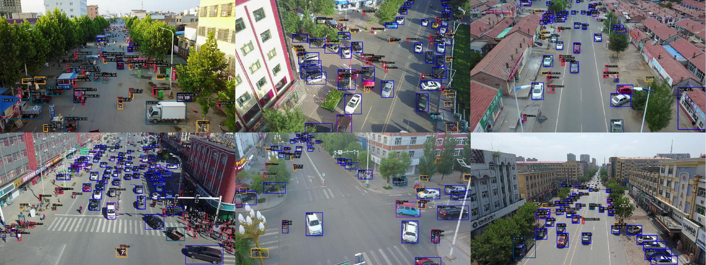
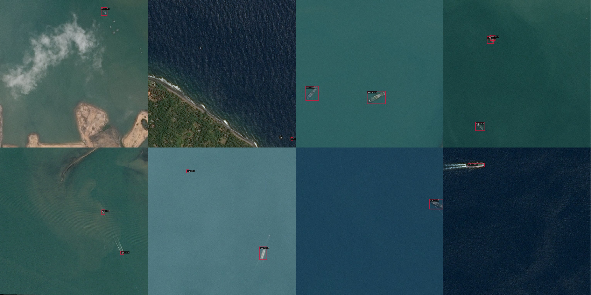

# MPA-Det

# Introduce
  
This is the official code for the paper MPA-Det: Multi-path Aggregation-Based Object Detection Network.

This project is built based on mmdetection 3.1 and mmcv 2.0.1.

# Environment

pytorch 1.12.0

torchvision 0.13.0

mmdetection 3.1

mmcv 2.0.1

The installation and usage of mmdetection can be referred to at the following link: https://mmdetection.readthedocs.io/en/latest/get_started.html.

For other environment requirements, please refer to mmdetection.

# Training and Test
The training and test commands can also be referenced from mmdetection.

1 gpu:

```shell
python tools/train.py ./MPA-Det/MPA-Det_VisDrone.py
```
```shell
python tools/test.py ./MPA-Det/MPA-Det_VisDrone.py your_model.pth
```

If you need to use more GPUs, you should use ./tools/dist_train.sh instead of tools/train.py.

# Datasets

The link to VisDrone2019: https://github.com/VisDrone/VisDrone-Dataset.

The link to AirBus: https://www.kaggle.com/datasets/mikaelstrauhs/airbus-ship-detection-train-set-30.

# Examples


<center><p>Detection results in VisDrone2019</p></center>


<center><p>Detection results in AirBus</p></center>